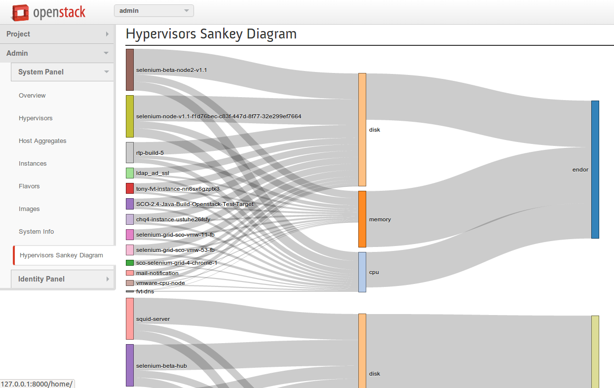

Comb

============

D3 Sankey Diagram horizon plugin:
View Hypervisors and VM instances in [Sankey Diagram](http://en.wikipedia.org/wiki/Sankey_diagram) using [D3's Sankey plugin](https://github.com/d3/d3-plugins/tree/master/sankey)

To install
- install horizon

Then, edit your openstack_dashboard/dashboards/admin/dashboard.py file:
- add ‘sankey’ to panels tuple;

